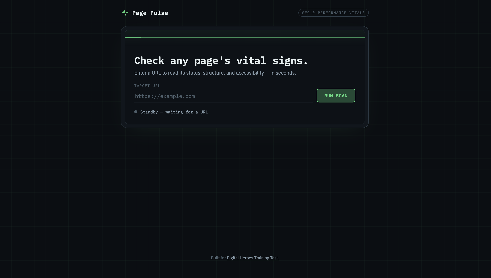
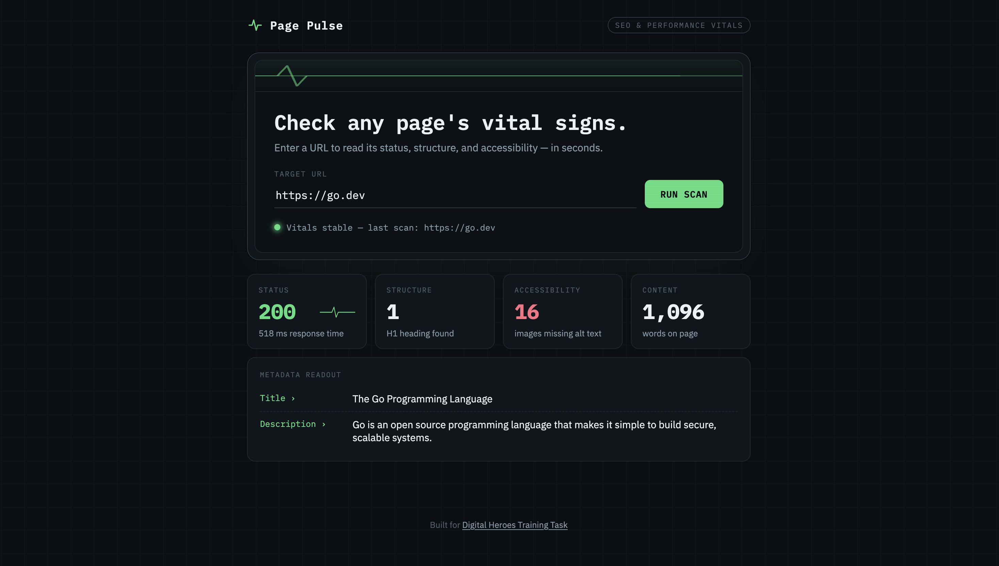
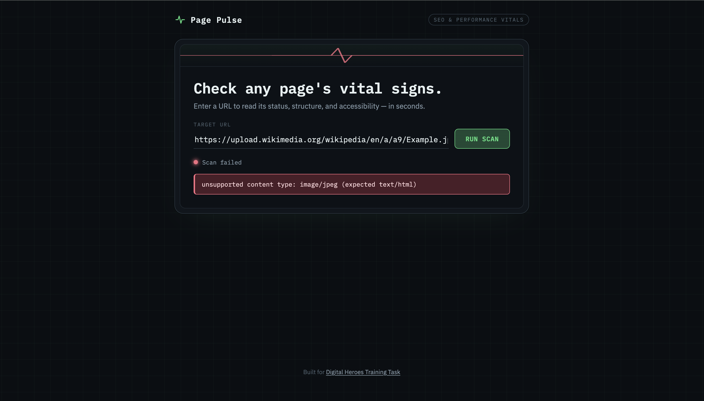
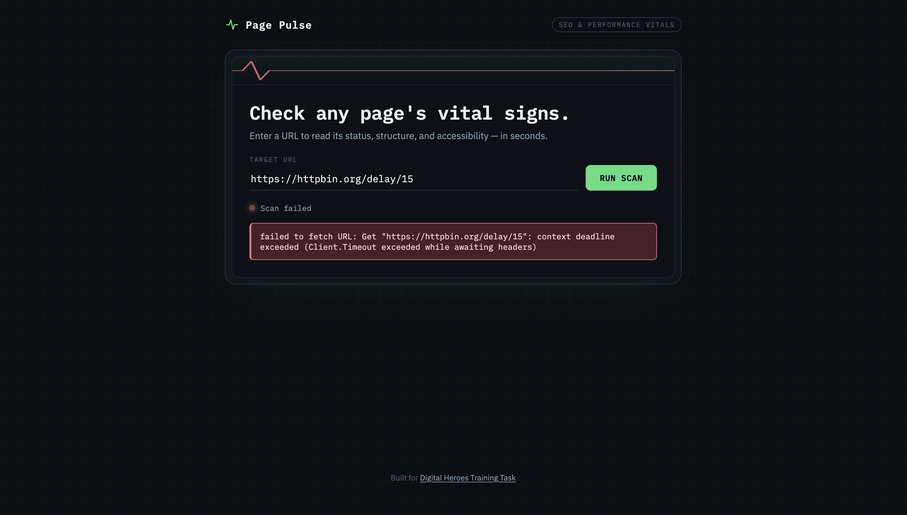
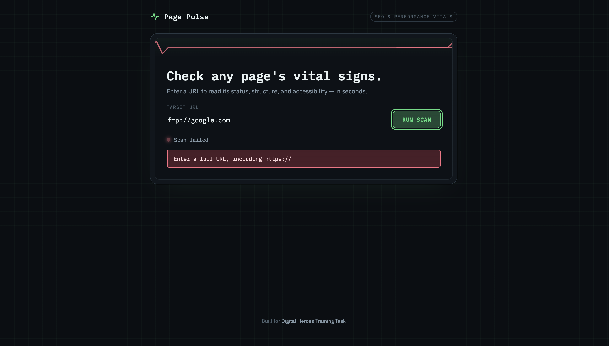

# 🚀 Page Pulse

> Page Pulse is a full-stack Go application designed for high-performance web auditing and SEO analysis. It provides instant, actionable insights into page structure, metadata, and accessibility compliance.


---

## ✨ Features

- ⚡ Fast HTML parsing using Go's streaming tokenizer
- 📊 SEO metadata analysis
- ♿ Accessibility checks
- 🖼️ Detects images missing `alt` attributes
- 📝 Accurate visible-text word counting
- ⏱️ Response time measurement
- 🛡️ Robust request validation and timeout protection

---

## 🌐 Live Demo

> **Deployed Application:**  
> `https://page-pulse-p42h.onrender.com`

---

# 📸 Screenshots

## Home Page

<p align="center">
  
</p>

---

## Successful Audit

<p align="center">
  
</p>

---

## Error Handling

<p align="center">
  
</p>

<p align="center">
  
</p>

<p align="center">
  
</p>

---

## 🎥 Demo

<p align="center">
  
</p>

---

# 🏗️ Project Structure

```
page-pulse/
├── assets/               # README Documentation Screenshots
│   ├── home.png
│   ├── success.png
│   ├── invalid_url_error.png
│   ├── non_html_error.png
│   └── timeout_error.png
├── cmd/
│   └── server/
│       └── main.go
├── internal/
│   ├── api/
│   │   ├── handlers.go
│   │   └── routes.go
│   └── auditor/
│       ├── auditor.go
│       └── auditor_test.go
├── public/               # Served Web Assets
│   ├── index.html
│   ├── script.js
│   └── style.css
├── go.mod
├── go.sum
└── README.md
```

---

# ⚙️ Installation

## Prerequisites

- Go **1.21+**
- Git

## Clone the Repository

```bash
git clone https://github.com/arunima10a/page-pulse.git

cd page-pulse
```

## Run the Application

```bash
go run cmd/server/main.go
```

Open your browser and visit:

```
http://localhost:8080
```

---

# 🧪 Running Tests

Run the complete test suite:

```bash
go test ./internal/auditor/... -v
```

---

# 📡 API Reference

## GET `/api/audit`

Analyzes a webpage and returns a structured SEO report.

### Query Parameters

| Parameter | Type | Required | Description |
|-----------|------|----------|-------------|
| `url` | string | ✅ | Absolute URL to audit |

Example:

```
GET /api/audit?url=https://example.com
```

---

## Successful Response

```json
{
  "url": "https://example.com",
  "status": 200,
  "response_time_ms": 145,
  "title": "Example Domain",
  "meta_description": "...",
  "h1_count": 1,
  "images_missing_alt": 0,
  "word_count": 45,
  "request_time": "2023-10-27T10:00:00Z"
}
```

---

## Error Response

```json
{
  "error": "unsupported content type: image/jpeg (expected text/html)"
}
```

---

# 🧠 Design Decisions

## 1. Streaming HTML Parsing

### Decision

Uses Go's `golang.org/x/net/html` tokenizer to parse HTML as a stream.

### Why?

Instead of loading an entire page into memory, the parser processes tokens incrementally, allowing it to handle very large pages with a small and constant memory footprint.

---

## 2. Context-Aware Word Counting

### Decision

Counts only human-readable text inside the `<body>` element while ignoring:

- `<script>`
- `<style>`
- `<noscript>`

### Why?

SEO metrics should reflect only content visible to users, not JavaScript or CSS.

---

## 3. Modular Architecture

### Decision

Separated the application into:

- `internal/auditor` → Business logic
- `internal/api` → HTTP layer

### Why?

This separation allows the parser to be tested independently of the web server, improving maintainability and enabling faster unit testing.

---

# 🛡️ Robustness

### Browser User-Agent

Uses a modern Chrome User-Agent to reduce the chance of requests being blocked by websites with anti-bot protection.

---

### Request Timeout

All outgoing requests use a strict **10-second timeout**, preventing hanging requests from consuming server resources.

---

### URL Validation

Only `http://` and `https://` URLs are accepted to reduce the risk of malformed requests and common SSRF vectors.

---

# 🛠️ Built With

- Go
- HTML
- CSS
- JavaScript
- jQuery

---

# 🚀 Future Improvements

- Export reports as PDF
- Lighthouse-style scoring
- Additional accessibility rules
- Broken link detection
- Keyword density analysis
- Dark mode
- Audit history

---

# 🎓 Credits

Built as part of the **Digital Heroes Training Task**.

```
https://digitalheroesco.com
```

---

